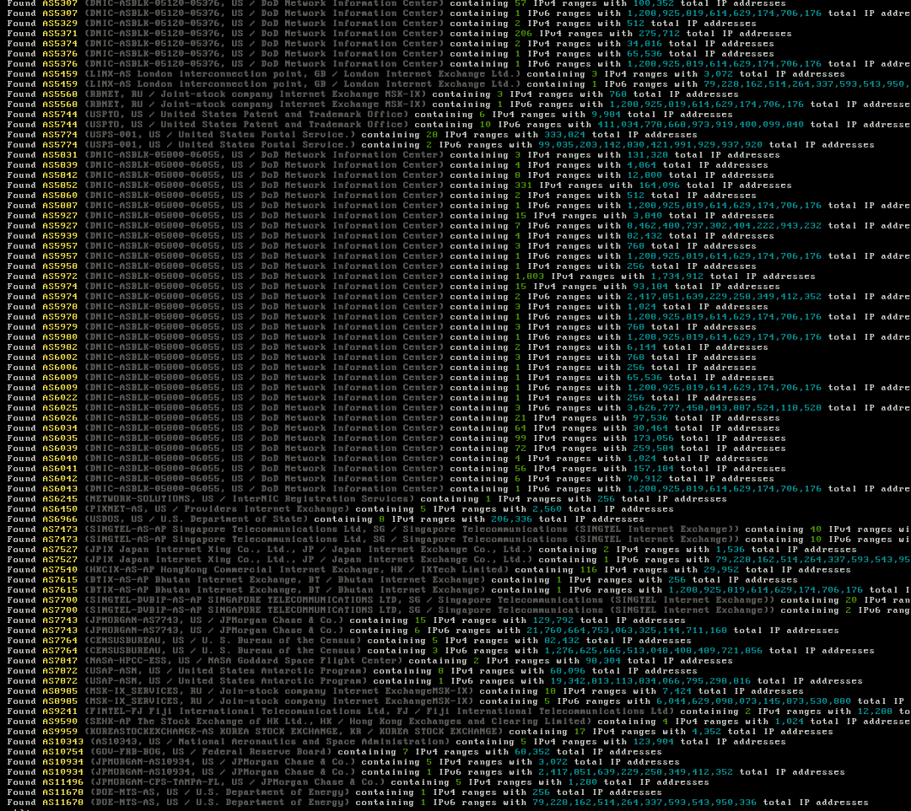

# avoidr
> masscan with exclusive exclusions



## Information
This is still a work in progress.

This is just a little side project I am working on that will search keywords in a database of **Autonomous System Numbers** *(ASN)*. The ASN is then turned into a list of its respective IP ranges that fall under it using the [BGP View API](https://bgpview.docs.apiary.io/).

Below is a list of queries we look for:

```python
['754th Electronic Systems Group', 'Air Force Systems Command', 'Army & Navy Building', 'Central Intelligence Agency', 'Defense Advanced Research Projects Agency',
'Department of Homeland Security', 'Department of Justice', 'Department of Transportation', 'DoD Network Information Center', 'Dod Joint Spectrum Center',
'FBI Criminal Justice Information Systems', 'Institute of Nuclear Power Operations, Inc', 'Merit Network Inc', 'NASA Ames Research Center', 'NASA Deep Space Network (DSN)',
'NASA Goddard Space Flight Center', 'Navy Federal Credit Union', 'Navy Network Information Center', 'Nuclear Science and Technology Organisation',
'Organization for Nuclear Research', 'Root Server Technical Operations', 'Securities & Exchange Commission', 'Securities And Exchange Commission', 'U. S. Air Force',
'U. S. Bureau of the Census', 'U. S. Department of Transportation', 'U.S. Department of Energy', 'USAISC', 'USDOE, NV Operations Office', 'United States Antarctic Program',
'United States Coast Guard', 'United States Geological Survey', 'United States Naval Institute', 'United States Nuclear Regulatory Commission',
'United States Patent and Trademark Office', 'United States Postal Service', 'Internet Exchange', 'Stock Exchange','Federal Emergency Management Agency','Federal Aviation Agency',
'Federal Energy Regulatory Commission','Federal Aviation Administration','Federal Deposit Insurance Corporation','Federal Reserve Board', 'National Aeronautics and Space Administration',
'US National Institute of Standards & Technology','Government Telecommunications and Informatics Services','U.S. Dept. of Commerce','U.S. Center For Disease Control and Prevention',
'U.S. Fish and Wildlife Service','Department of National Defence','U.S. Department of State','Bank of America','JPMorgan Chase & Co','Facebook Inc','Twitter Inc']
```

The ranges are all stored in a JSON file for easy parsing. Depending on what you are scanning for, this list can be altered to better suit your needs.

As it stands, there are *4,294,967,296* IPv4 addresses. After excluding reserved, private, & governement ranges, you can drop that number almost in half, thus speeding up your scan times.

## Todo
- distributed masscan using the masscan python library
- masscan exclude.conf output format *(with comments describing the ranges)*
- possibly find a database that contains all the prefixes behind an ASN *(bgpview heavily throttles and can only handle 1 ASN at a time)* *(for now a bad.json is generated to list empty ASN's)*
- Seperate queries by sectors *(Government, social media, financial institutons, schools, etc)*

___

###### Mirrors
[acid.vegas](https://git.acid.vegas/avoidr) • [GitHub](https://github.com/acidvegas/avoidr) • [GitLab](https://gitlab.com/acidvegas/avoidr) • [SuperNETs](https://git.supernets.org/acidvegas/avoidr)
