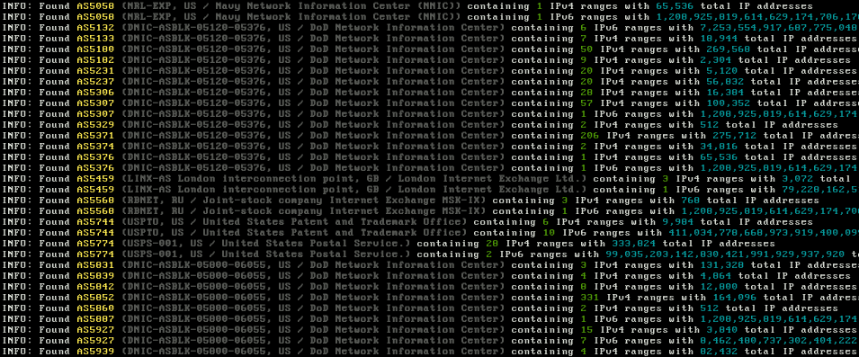

# avoidr

Avoidr is a Python-based utility designed to enhance the functionality of scanning tools like masscan by providing a means to generate exclusive exclusions of IP addresses. It operates by searching through an ASN *(Autonomous System Number)* database for user-defined strings, identifying all IP ranges associated with the ASNs that match the search criteria.

This targeted approach is particularly useful for users seeking to avoid scanning IP ranges belonging to government entities or other sensitive domains. The project streamlines the process of filtering out specific IP ranges, thereby facilitating safer and more responsible scanning activities.

## Usage

To use Avoidr, simply run the script with the desired arguments:
| Argument          | Description                                          |
| ----------------- | ---------------------------------------------------- |
| `-4`, `--ipv4`    | Process IPv4 addresses only                          |
| `-6`, `--ipv6`    | Process IPv6 addresses only                          |
| `-x`, `--exclude` | Create exclusions for masscan instead of JSON output |
| `-s`, `--search`  | Comma-separated strings to search *(no output file)* |
| `-u`, `--update`  | Update the ASN database                              |

The script can generate a JSON file with the results or a .conf file with the exclusions ready to be used by masscan.

## Custom Queries
The `custom.txt` file serves as a configuration input for Avoidr, containing a list of keywords corresponding to organizations whose IP ranges users wish to exclude from network scanning activities. When Avoidr processes this file, it searches the ASN database for these keywords, retrieves the related IP ranges, and generates a list of exclusions to prevent scanning tools like masscan from interacting with potentially sensitive or restricted network spaces.

The predefined list in the `custom.txt` file will yeild roughly **358,402,432​​** IPv4 addresses, which is almost **10%** of the total IPv4 address space.

## Preview

___

###### Mirrors
[acid.vegas](https://git.acid.vegas/avoidr) • [GitHub](https://github.com/acidvegas/avoidr) • [GitLab](https://gitlab.com/acidvegas/avoidr) • [SuperNETs](https://git.supernets.org/acidvegas/avoidr)
